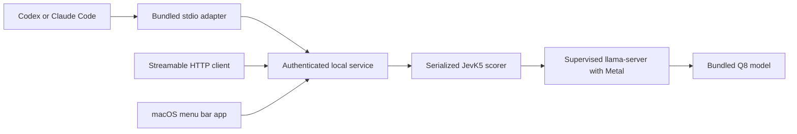

# Benchmarking JevK5 on an M5 Max and building a local MCP app

*Benchmarks performed September 30, 2026. App verification completed through October 1, 2026.*

I wanted a small decision model that other agents could call on my Mac. My first question was straightforward: how fast could JevK5-4B run on an M5 Max with 128 GB of unified memory?

That became a sequence of experiments: test the suggested llama.cpp recipe, compare quantizations, try a direct MLX implementation, investigate caching, and package the working implementation into a macOS menu bar app with an MCP server. I worked with Codex to run the benchmarks and build the app, with independent checks of the numerical records and implementation.

The final bundle's synthetic smoke check measured **71.8 ms for one fresh short decision** and **17.1 ms median across ten identical repeats**. Those are service timings with the model already loaded. They exclude the MCP client's transport overhead. Longer inputs took substantially more time, and none of these measurements establish the model's accuracy on a production workflow.

The useful outcome was a local model service with a clear contract: give it evidence and a bounded decision, receive probabilities, and let the calling agent decide what to do next.

## What JevK5 actually does

[JevK5](https://github.com/allebee/jevk5/blob/f944fe37ff1d5ed3830aa4c8d88b7189c8c1268a/README.md) is an independent open-source alternative to TypeSafe's Jev. The 4B model is based on Qwen3.5-4B and supports three decision types: true/false, categorical choice, and score. Its readout applies a softmax to the answer options' next-token logits.

That makes the relevant performance question different from a long chat response. The work is largely evaluating the input and reading the option scores. The GGUF client requests one auxiliary token to obtain log-probabilities; it does not ask the model to write an explanation.

The app exposes those decisions directly. Evidence can be a string, object, or array. Each question supplies an instruction and, for choices or scores, the alternatives. This is useful for questions such as which team should handle a ticket, whether evidence satisfies a policy, or where a report falls on a defined rubric.

The model has no retrieval component in this app. The caller supplies the evidence it should assess.

## Establishing a baseline

The machine was a MacBook Pro with an M5 Max, 18 CPU cores, 40 GPU cores, and 128 GB of unified memory, running macOS 26.7.1 on AC power in normal power mode.

The first experiment used llama.cpp 0.5.0, build 11146, with ggml 0.25.3 and the official JevK5-4B v0.3 GGUF files. I compared Q8_0, approximately 4.48 GB, with Q5_K_M, approximately 3.07 GB.

Before inference, we froze the recipes, workload, and comparison rule. Both quantizations used one server slot, an 8192-token context, 99 requested GPU layers, automatic flash attention, and no context shifting. Prompt caching was disabled. The native JevK5 prompt formatter and probability readout were preserved, including the model's temperature of 1.22.

The workload contained 81 unique cases: a short refund-policy example plus synthetic policy and routing decisions at approximately 256, 512, 2048, and 4096 full-prompt tokens. Timed questions used two-option boolean decisions and three-option routing; larger option counts were not benchmarked. Four sequential sessions produced 440 measured decisions, with 60 warmups excluded. Each quantization had two sessions. The cases were deliberately simple; this was a latency and numerical-consistency experiment.

Timing included client tokenization over loopback HTTP, the completion request, model evaluation, parsing, and normalization. Downloads, model loading, input preparation, and warmups were outside the timed requests.

| Full prompt length | Timed calls per quantization | Q8 median / p95 | Q5 median / p95 |
| --- | ---: | ---: | ---: |
| 132 tokens | 60 | 118.5 / 130.2 ms | 122.3 / 132.1 ms |
| 255–256 tokens | 40 | 164.3 / 176.4 ms | 165.9 / 185.6 ms |
| 511–512 tokens | 40 | 248.2 / 312.0 ms | 260.0 / 281.9 ms |
| 2047–2048 tokens | 40 | 915.6 / 1105.7 ms | 949.8 / 1008.4 ms |
| 4095–4096 tokens | 40 | 1907.2 / 2095.6 ms | 1962.5 / 2001.9 ms |

Q5 reduced the file size but did not produce a latency benefit in any cohort. Its medians were 1.0–4.7% higher. Neither the size reduction nor those small timing differences supported switching away from Q8 on this machine.

Q8 and Q5 selected the same option on all 81 unique cases. Their probabilities still differed by as much as 0.02768, or about 2.77 percentage points. Matching winners is only one consistency check; a probability-based escalation policy can be sensitive to changes that leave the winner unchanged.

Model computation dominated the baseline. The Q8 engine median was 115.4 ms for the short example, against 118.5 ms for the client wall time. Removing a few milliseconds of HTTP overhead would have had limited effect on that recipe.

An independent audit recomputed the summaries and checked hashes, request coverage, token identities, and probability invariants: 6458 checks, zero errors.

## Trying MLX and other speedups

I also wanted to know whether Apple's MLX stack could do better. We built a direct BF16 MLX scorer that preserved the native prompt and read the relevant answer logits. It evaluated fresh recurrent/KV state for each request and forced tensor evaluation before stopping the timer.

The two-session comparison looked like this:

| Full prompt length | llama.cpp Q8 median / p95 | Direct MLX BF16 median / p95 |
| --- | ---: | ---: |
| 132 tokens | 71.1 / 76.9 ms | 68.4 / 79.9 ms |
| Approximately 256 | 107.7 / 118.2 ms | 90.7 / 121.0 ms |
| Approximately 512 | 163.6 / 175.9 ms | 153.7 / 215.3 ms |
| Approximately 2048 | 630.3 / 661.0 ms | 651.7 / 806.6 ms |
| Approximately 4096 | 1310.2 / 1344.3 ms | 1325.0 / 1496.9 ms |

There are two important boundaries around this table.

First, unchanged llama.cpp controls were faster here than in the original baseline. The short example dropped from roughly 118 ms to 71 ms without a qualifying settings change. We cannot credit that difference to tuning. Additional unchanged sessions showed meaningful workstation variability, and the runtime arms were measured sequentially without randomized machine state.

Second, this comparison changed runtime and weight precision together. MLX used BF16 in one Python process; Q8 used the official client and two loopback HTTP calls. It measures those complete recipes. It does not isolate the contribution of MLX kernels.

Only the approximately 256-token cohort passed the registered rule: at least a 10% median improvement, with both MLX session medians beating both Q8 session medians. Longer prompts showed no broad advantage, and MLX's p95 was higher in every cohort.

The implementations selected the same option on all 81 cases in both paired sessions, with a maximum probability difference of approximately 0.01014. Token counts and token identities matched.

I had also considered [MLX-Serve](https://github.com/ddalcu/mlx-serve), which provides local inference APIs for Apple silicon. Our measured MLX implementation was a custom in-process scorer; we did not benchmark MLX-Serve. A JevK5 integration with another server needs checks of the exact prompt, tokenization, option log-probabilities, and temperature readout. Loading the checkpoint is only part of the integration.

We screened larger llama.cpp batches and forced flash attention. They preserved the tested probabilities but increased the mixed-input median, so the original settings remained.

A separate, smaller MLX screen tested compilation and linear-layer quantization. Each recipe had 12 distinct decisions and ten repeated examples, for 110 measured calls across five recipes:

| MLX recipe | Distinct-case median | Change from BF16 | Maximum probability difference |
| --- | ---: | ---: | ---: |
| BF16 control | 242.8 ms | — | 0 |
| BF16 compiled | 280.4 ms | +15.5% | 0 |
| 8-bit linear-only | 314.5 ms | +29.5% | 0.01142 |
| 4-bit linear-only | 303.9 ms | +25.2% | 0.07738 |
| 8-bit linear-only compiled | 315.7 ms | +30.0% | 0.01142 |

No candidate passed both the 10% speed-improvement requirement and the maximum probability-difference limit of 0.01. Full confirmation was therefore not run. These were one-session development screens, so their medians should not be compared with the larger earlier studies as evidence of a general speed change.

## The biggest repeat-call improvement came from caching

Exact repeats were a different workload. Enabling llama.cpp prompt caching for identical inputs brought the short example to approximately 17–18 ms and 4096-token repeats to approximately 20–22 ms. The tested probabilities matched the uncached references exactly.

This was prompt-state reuse. The implementation still tokenized the request, called the model server, and formatted a decision; it did not return a stored response from disk.

The app adopts a deliberately narrow rule: enable prompt caching only when the entire token sequence equals the immediately preceding successful completion's token sequence. A change in evidence, instructions, or ordered options disables reuse. An inference error, pause, or restart clears the remembered identity.

That means an A, A, B, A sequence has an opportunity for reuse on the second call only. Multiple agents share the same model, so an intervening request can remove that opportunity. These measurements do not establish a speedup for arbitrary shared prefixes or independent new decisions.

The cache policy also depends on serialization. One shared lock covers the complete decision, including tokenization, inference, and answer formatting. A client disconnect cannot release that lock while its inference thread is still running. Without that ownership rule, another request could modify the same model state mid-decision.

## Turning the experiment into a menu bar app

Once the runtime choice was settled, I wanted agents to use it without managing a benchmark server. The app design put one resident model behind two interfaces: a native menu bar controller and an MCP service.



The native AppKit app owns the backend. The backend owns a supervised llama-server process. MCP clients reach the same backend, so connecting Codex and Claude Code does not load two copies of the model.

The menu includes status, pause/resume, service restart, configuration copying, and a launch-at-login setting. Pausing unloads the model and rejects decisions until resumed. Requests are serialized and bounded; overload produces an error instead of an unlimited queue.

The built app contains the Q8 model, a private Python runtime, locked server dependencies, llama.cpp, its libraries, and Metal plugins. The approximately 4.3 GiB bundle can run without a separate Homebrew or Python installation. This particular build targets Apple silicon and macOS 26 or newer.

The final recipe uses an 8192-token context, one inference slot, batch size 2048, microbatch size 512, automatic flash attention, and no context shifting. Model identity, SHA-256, and the named calibration profile travel with the results. Inputs that exceed the context budget or fail complete option coverage are rejected.

Inside the local app repository, the build is driven by `uv`:

```sh
uv sync --frozen
uv run scripts/fetch_model.py
uv run scripts/build.py
open dist/JevK5.app
```

Building requires the development toolchain and the tested llama.cpp installation. The generated app carries its own runtime. The delivered bundle uses CPython 3.12.13 and MCP SDK 1.30.0, with Python dependencies pinned in `uv.lock`.

### A packaging trap worth testing

Copying the executable and rewriting its linked libraries was insufficient. The pinned ggml build also searched a compiled-in Homebrew directory for backend plugins. A bundle could appear self-contained while still finding a plugin in the development environment.

For this ggml version, `GGML_BACKEND_PATH` accepts a single plugin file; pointing it at a directory did not solve the problem. The builder disables exactly one known compiled-in directory string in the copied library, preserving its length and offsets. It then launches from the bundled plugin directory, relocates Mach-O dependencies, records the hashes, and signs after rewriting. An unexpected binary layout causes the build to fail.

Relocation testing checked the result. The moved app completed a real model decision, loaded its bundled Metal, BLAS, and CPU plugins, and showed no Homebrew library paths in the inspected dynamic-loader output. Strict code-signature verification also passed.

Process cleanup required similar care. A small native supervisor reaps the inference child if the backend is killed, including with SIGKILL. Parent monitoring closes the backend when the menu app disappears. Those paths were tested, along with recovery through the stdio adapter and auto-launch from a relocated bundle.

## Making the model available through MCP

The MCP surface contains two tools:

- `jevk5_decide(state, question)` applies a criterion to the supplied evidence.
- `jevk5_status()` reports readiness, pause state, model identity, and aggregate counts.

The service uses the official Python MCP SDK and supports Streamable HTTP at `http://127.0.0.1:19385/mcp`. A bundled stdio adapter is convenient for desktop coding agents: it opens the app when needed, handles local authentication, and forwards decisions to the shared backend.

For example, this is a fictional routing request:

```json
{
  "state": "The customer reports being charged twice for the same order.",
  "question": {
    "type": "choice",
    "instructions": "Select the team that should handle this ticket.",
    "criteria": {
      "billing": "Charges, invoices, and refunds",
      "technical": "Software failures and troubleshooting",
      "account": "Login and account access"
    }
  }
}
```

The returned decision sits inside `answer`. This simplified response illustrates the shape; the numbers are hypothetical:

```json
{
  "answer": {
    "type": "choice",
    "choice": "billing",
    "confidence": 0.61,
    "probabilities": {
      "billing": 0.61,
      "technical": 0.34,
      "account": 0.05
    }
  },
  "cache": {
    "hit": false,
    "policy": "identical-consecutive"
  }
}
```

The full result also includes service latency, engine timing, logical input-token count, and model/profile identity. Service latency can include waiting for the shared model; it excludes the outer MCP transport and JSON-RPC handling. Engine timing is narrower still. Those boundaries matter when comparing a tool call with an in-process benchmark.

For Claude Code, the registration points at the adapter inside the app bundle:

```sh
JEVK5_APP="/absolute/path/to/JevK5.app"
claude mcp add --transport stdio --scope user jevk5 -- \
  "$JEVK5_APP/Contents/MacOS/jevk5-mcp"
```

Replace the placeholder with the app's actual location, start a new Claude Code session, and inspect `/mcp`. User scope makes the registration available across projects. This follows [Claude Code's MCP setup](https://code.claude.com/docs/en/mcp). For Codex, the repository includes an installation script that preserves other server entries and registers the same bundled adapter.

One contract issue surfaced during use: the initial MCP schema allowed object criteria for score questions while validation required an ordered array. The fix introduced question-specific schemas shared by HTTP, stdio, and the local API. Score criteria now require 2–16 ordered descriptions, representing levels 0 through N−1. Choice questions continue accepting arrays or objects. Regression checks compare the exported schema with actual validation.

Local transport also needs access controls. Every HTTP route requires a bearer token and validates Host and Origin. Bodies are bounded, and services bind to loopback. The connection file is readable only by the owning user. These controls follow the [MCP transport specification](https://modelcontextprotocol.io/specification/2025-11-25/basic/transports).

The app has no request history or telemetry, and it avoids logging evidence, options, responses, or credentials. Processes already running as the same user remain inside its trust boundary. If the calling agent later sends evidence to a remote model, that is a separate caller-side action; local JevK5 inference does not make the entire agent workflow local.

## Using probabilities to decide when to escalate

Every answer includes `confidence`, computed as the highest option probability. For a boolean question, `noul` is the probability of true; the probability of false is `1 − noul`. Choice answers return the winning option and the full distribution. Score answers return the expected numeric level and the distribution over levels.

Those fields allow a caller to route uncertain decisions to a stronger model. A boolean or choice policy might accept a result above a chosen confidence threshold and escalate below it. The app itself does not perform that escalation.

The threshold needs task-specific validation. A confidence of 0.85 is not a demonstrated 85% accuracy guarantee for an arbitrary workflow. The benchmarks checked speed, token integrity, and numerical behavior; they did not fit or validate a production routing policy.

Score distributions deserve additional care. Equal probability on two adjacent levels can give a useful expected score with low peak confidence. A distribution spread across opposite ends of the scale signals a different kind of ambiguity. The caller should use a decision rule appropriate to its rubric and error costs.

The next useful experiment is to collect representative labeled decisions, measure which errors survive a proposed acceptance threshold, and measure how often escalation occurs. That would test whether the small model reduces expensive calls while preserving the required quality.

## What the packaged app checks established

The app's verification reached 35 automated tests after the score-schema correction. The packaged model also passed 18 integration checks over real HTTP and stdio clients, six process/relocation checks, and a focused score-contract check through HTTP MCP, stdio MCP, and the local API.

Those checks covered authentication, malformed and oversized requests, context limits, option validation, exact repeats, changed evidence, concurrent callers sharing one model, pause/unload, and fresh cache state after resume. They also caught a subtle SDK behavior: a JSON-looking evidence string had to remain a string rather than being automatically decoded into an object.

Each repeat in the packaged smoke check reproduced the fresh boolean probability exactly. Its 130-token example and the earlier 132-token benchmark example are separate measurements, with different timing boundaries.

There are still delivery limits. The app is ad hoc signed for local use; Developer ID signing, notarization, an updater, and Intel support are not implemented. Automated inspection of the accessory/menu-only UI timed out, so menu clicks, clipboard copying, launch-at-login registration, and the Quit menu action were not visually verified. Process exit, control behavior, and model calls were tested directly.

The local build now gives my agents a resident decision service they can invoke through MCP. The remaining question is workload quality: which decisions should it handle, what acceptance rule should the caller use, and how much escalation is needed? Those are measurable questions, and they are the next ones worth answering.

*Implementation details and the packaged verification record are in the repository's [design](DESIGN.md), [verification report](VERIFICATION.md), and [README](../README.md). The latency tables above come from the frozen local baseline, optimization-v1 comparison, and optimization-v2 screen reports. All benchmark and integration evidence was synthetic; public weights were used throughout.*
